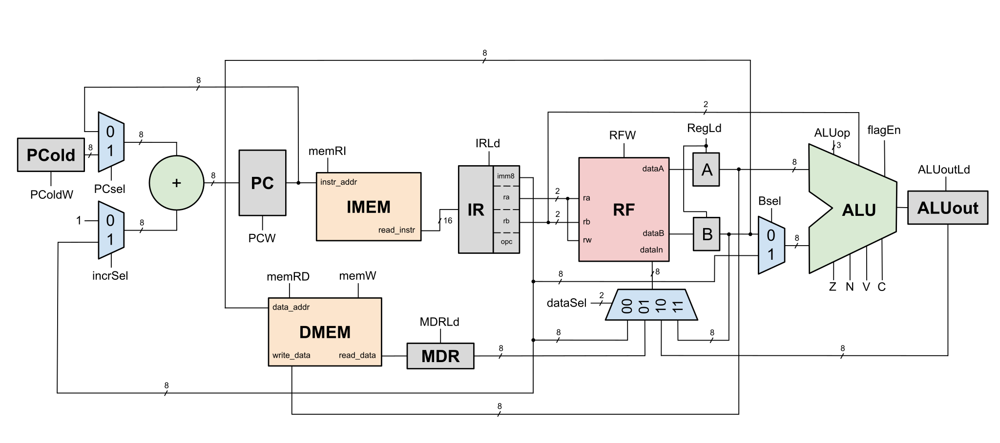

# 8-Bit Multi-Cycle CPU
A custom 8-bit multi-cycle CPU implemented in Verilog with 16-bit instructions. This CPU uses a Harvard-style architecture and includes a four-register Register File, an Arithmetic Logic Unit, a control unit, and automated simulation testbenches.



## Main Modules
* Instruction memory
* Data memory
* Program Counter (PC) Adder
* Arithmetic Logic Unit (ALU)
* Register File (RF)
* Control Unit (FSM)

## Architecture
### Memory Organization
The processor uses a Harvard-style architecture with separate instruction and data memories, each with 256 address locations. 

* 16-bit wide instruction memory is read-only; programs can be loaded from a testbench directly or with a memory initialization file 
* 8-bit wide data memory supports reads and writes

### PC Adder
The PC uses a dedicated adder instead of the ALU. It selects either a constant increment or the encoded 8-bit immediate of the instruction, and supports relative addressing. 

## Register file (RF)
The RF has four 8-bit general-purpose registers (r0-r3). 
* Has two read ports 'ra' and 'rb' for the encoded destination and source register
* Has one write port for register-write; the destination register is encoded by the 'ra' field of the instruction 

## Arithmetic Logic Unit (ALU)
The ALU supports:

* Arithmetic: addition (ADD), subtraction (SUB)
* Bitwise logic operations: AND, OR, XOR, NOT
* SHIFT, which handles:
    * Logical left (SLLI)
    * Logical right (SLRI)
    * Arithmetic right (SARI)

and outputs an 8-bit result.

The ALU also generates four condition flags:

* Z: Zero 
* N: Negative
* V: Signed overflow
* C: Carry out

used for branching instructions.

## Control Unit
The processor uses a finite state machine (FSM) to control the multi-cycle execution of instructions.

* Cycle 0: Fetch instruction and store current program counter value 
* Cycle 1: Load registers and increment program counter
* Cycle 2: Decode and execute instruction
* Cycle 3: Some instructions require an extra clock cycle to complete

## Instruction Set
The processor uses a custom 18-instruction ISA, encoded by 16 4-bit opcodes (0000-1111). 

Note: the SHIFT instruction uses additional bits in its encoding to support left/right and logical/arithmetic shifts.

| Instruction | Opcode | Syntax | Operation |
|----|----|----|----|
| load | 0000 | load ra, (rb) | ra <-- DMEM[rb] |
| store | 0001 | store ra, (rb) | DMEM[rb] <-- ra |
| mov | 0010 | mov ra, rb | ra <-- rb |
| ldi | 0011 | ldi ra, imm8 | ra <-- imm8 |
| add | 0100 | add ra, rb | ra <-- ra + rb |
| addi | 0101 | addi ra, imm8 | ra <-- ra + imm8 |
| sub | 0110 | sub ra, rb | ra <-- ra - rb |
| slli | 0111 | slli ra, imm3 | ra <-- ra << imm3 |
| slri | 0111 | slri ra, imm3 | ra <-- ra >> imm3 |
| sari | 0111 | sari ra, imm3 | ra <-- ra >>> imm3 |
| and | 1000 | and ra, rb | ra <-- ra & rb |
| or | 1001 | or ra, rb | ra <-- ra \| rb |
| xor | 1010 | xor ra, rb | ra <-- ra ^ rb |
| not | 1011 | not ra | ra <-- ~ra |
| jmp | 1100 | jmp imm8 | PC <-- PC + imm8 |
| bne | 1101 | bne ra, rb, imm8 | PC <-- PC + imm8 if ra != rb |
| bgt | 1110 | bgt ra, rb, imm8 | PC <-- PC + imm8 if signed ra > rb |
| bgtu | 1111 | bgtu ra, rb imm8 | PC <-- PC + imm8 if unsigned ra > rb |

## Running Programs
The processor currently does not include an assembler; programs must be written as 16-bit machine-code instructions and loaded into the instruction memory prior to simulation.

Programs can be loaded in two ways:
1. Assign instructions to the memory directly from the testbench

    Example: 
    ```CPU.IMEM.ROM[0] = 16'h0503; // ldi r0, 5```

2. Load instructions to the memory from a hexadecimal memory initialization file using $readmemh

    Example: 
    ```$readmemh("programs/example_program.hex", CPU.IMEM.ROM);```

    and inside example_program.hex:
    ```0503 // ldi r0, 5```
